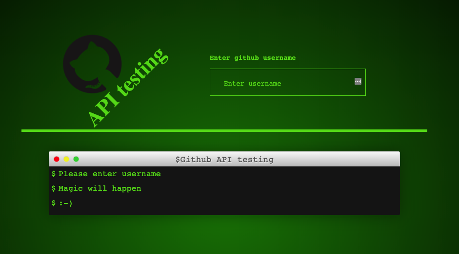

# Simple github API testing tool

Feel free to test it: [Github API testing tool](http://jundymek.github.io/wtf-api)

This is homework from [WTF](https://cotenfrontend.pl) frontend course.

It is the first API homework on WTF frontend course. It is a very simple project which lists user repositories. 

Tehnologies and tools used in this project:
- HTML5
- CSS3
    - flexbox 
    - grid
    - media queries
    - sass (scss syntax)
- JS ES6
- Visual Studio Code
- Figma (layout design)
- GULP
- GIT
- Node.js / NPM
- Github API (fetch javascript method)

and of course it is made fully responsive.
